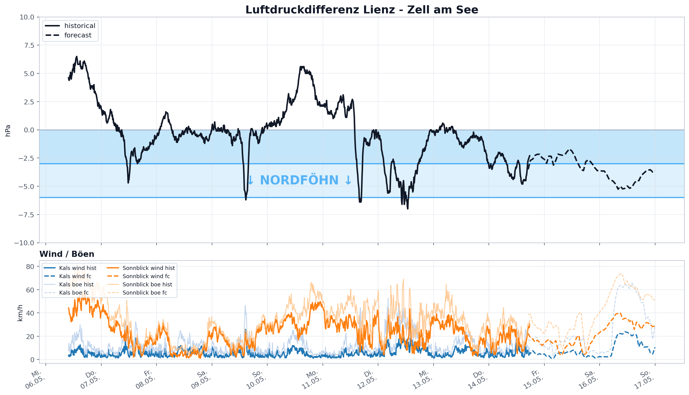

# Weather Study

Kleine Python-API fuer GeoSphere-Austria Stationsdaten, AROME-Forecasts und schnelle Wetterplots.



## Setup im Notebook

Wenn ein Notebook aus `notebooks/` gestartet wird, zuerst den Projektroot zum Importpfad hinzufuegen:

```python
from pathlib import Path
import sys

PROJECT_ROOT = Path.cwd().resolve()
if PROJECT_ROOT.name == "notebooks":
    PROJECT_ROOT = PROJECT_ROOT.parent

if str(PROJECT_ROOT) not in sys.path:
    sys.path.insert(0, str(PROJECT_ROOT))
```

Danach:

```python
from geosphere_api import meteogram, foehndiagramm
```

## Meteogramm

`meteogram()` erzeugt einen Wetterplot fuer eine Station mit Historie aus TAWES-Rohdaten und Forecast aus AROME/NWP.

```python
result = meteogram(
    station="Lienz",
    history="12h",
    forecast=None,  # None = laengst verfuegbarer AROME-Forecast
    show_data=["precip", "temp", "pressure", "wind"],
    mode="bright",  # "bright" oder "dark"
    output=PROJECT_ROOT / "outputs" / "lienz_meteogram_bright_pressure.png",
)
```

Rueckgabe:

```python
result["station"]
result["historical"]
result["forecast"]
result["fig"]
result["axes"]
result["output"]
```

Moegliche Panels in `show_data`:

- `"precip"`: Niederschlag/Schnee, falls vorhanden
- `"temp"`: Temperatur und abgeleiteter Taupunkt
- `"pressure"`: Luftdruck
- `"wind"`: Windgeschwindigkeit und Windrichtung

Hinweise:

- Historie nutzt `station/historical/tawes-v1-10min`.
- TAWES `RR` ist Niederschlag der letzten 10 Minuten in mm und wird im Plot auf Stundensummen aggregiert.
- Forecast nutzt `timeseries/forecast/nwp-v1-1h-2500m`.
- AROME `rr_acc` ist kumulierter Niederschlag in `kg m-2`; fuer Wasser entspricht das praktisch mm. Im Plot wird daraus eine stuendliche Differenz berechnet.
- AROME `sp` ist Surface Pressure auf der Modelloberflaeche. Fuer den Plot wird der Forecast-Druck optisch an die letzte Historie angehaengt, damit die Tendenz lesbar bleibt.

## Foehndiagramm

`foehndiagramm()` vergleicht den Luftdruck zwischen zwei Stationen und visualisiert den Nordfoehn-Bereich.

```python
foehn = foehndiagramm(
    south="Lienz",
    north="Zell am See",
    history="72h",
    forecast=None,
    wind_stations=["Lienz", "Sonnblick", "Kals"],
    include_gusts=True,
    mode="bright",
    output=PROJECT_ROOT / "outputs" / "foehndiagramm_lienz_zellamsee_wind_kals.png",
)
```

Rueckgabe:

```python
foehn["south"]
foehn["north"]
foehn["historical"]
foehn["forecast"]
foehn["wind"]
foehn["fig"]
foehn["axes"]
foehn["output"]
```

Hinweise:

- Historische Druckdifferenz nutzt TAWES `PRED`, also reduzierten Luftdruck in hPa.
- Forecast-Druckdifferenz nutzt AROME `sp`, weil AROME in diesem Datensatz keinen reduzierten Druck anbietet.
- Die Forecast-Druckdifferenz wird an die letzte historische Differenz ge-offsettet. Das ist fuer die Tendenz sinnvoll, aber nicht so sauber wie ein echter reduzierter Modell-Druck.
- Standard-Schwellen: `-3 hPa` und `-6 hPa`.
- `wind_stations` fuegt ein zweites Panel mit Wind und optional Boeen hinzu.
- TAWES Boeen: `FFX`.
- AROME Boeen: `ugust` und `vgust`, daraus wird die Boeengeschwindigkeit berechnet.

## Stationssuche

Bei mehreren Treffern kann eine Station manuell ausgewaehlt werden:

```python
from geosphere_api import station

matches = station("Lienz")
matches

lienz = matches.select(0) if hasattr(matches, "select") else matches
```

Direktwahl:

```python
lienz = station("Lienz", choose=0)
```

## Datenquellen

- GeoSphere Stationsdaten: https://data.hub.geosphere.at/group/stationsdaten
- TAWES 10-Minuten-Rohdaten: https://data.hub.geosphere.at/dataset/tawes-v1-10min
- AROME/NWP Forecast: https://data.hub.geosphere.at/dataset/nwp-v1-1h-2500m
- GeoSphere Dataset API Doku: https://dataset.api.hub.geosphere.at/v1/docs/

## Projektstruktur

```text
geosphere_api/   lokale API-Wrapper und Plotfunktionen
notebooks/       Test- und Analyse-Notebooks
outputs/         versionierbare Beispielplots
learnings/       technische Notizen zu GeoSphere-Endpunkten
```
